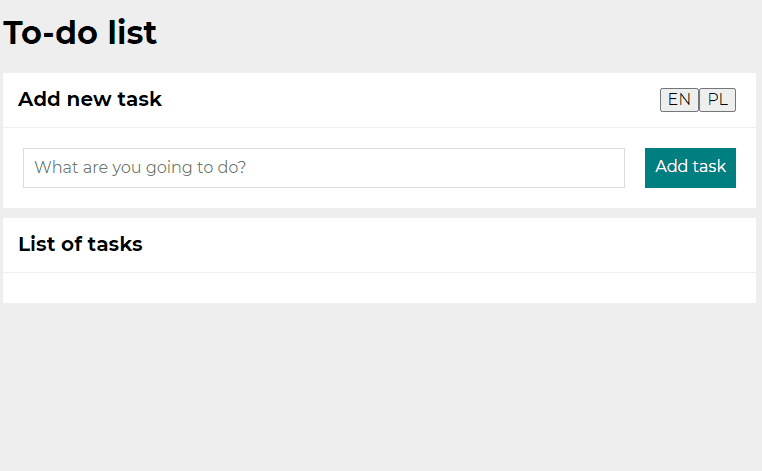
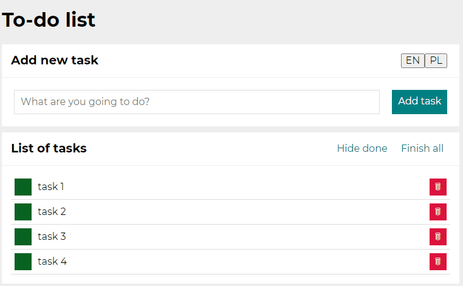
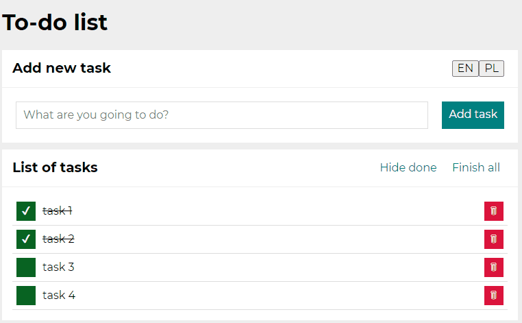

# Todo-list

Todo list made using React.js

## Demo:

https://mcesarczyk.github.io/todo-list-react/

## Used technologies:
- html
- CSS
- CSS-Flexbox
- CSS-Grid
- Media queries
- JS/ES6+
- BEM
- Immutability
- React.js (useState, useEffect)
- localStorage

## Short description:
With this app You're able to:
- add/remove tasks
- mark it as done individually
- mark as done all at once
- hide done tasks
- change interface language

## How to use this app:

1. To add task write its content and click "Add task" button or simply click Enter.

2. If you want to mark task as done click on green field on the list. In the same way you can uncheck chosen tasks.

3. If you want to hide all done tasks clisk on button "Hide done". Description on button will now change to "Show done". To restore tasks, click this button again.

4. When you done all task and want to check them, click on "Finish all". Please notice that button will now become inactive, but if you uncheck any task, button will become active again.

5. To remove single task click on red button with trash bin icon on right. When you remove all task buttons above list will disappear.

6. If you would like to change aplication language to polish, you can do it by clicking button at the top of a form with abreviation "PL". To switch back to english use proper button marked with "EN".

# Getting Started with Create React App

This project was bootstrapped with [Create React App](https://github.com/facebook/create-react-app).

## Available Scripts

In the project directory, you can run:

### `npm start`

Runs the app in the development mode.\
Open [http://localhost:3000](http://localhost:3000) to view it in the browser.

The page will reload if you make edits.\
You will also see any lint errors in the console.

### `npm run build`

Builds the app for production to the `build` folder.\
It correctly bundles React in production mode and optimizes the build for the best performance.

The build is minified and the filenames include the hashes.\
Your app is ready to be deployed!

See the section about [deployment](https://facebook.github.io/create-react-app/docs/deployment) for more information.

### `npm run eject`

**Note: this is a one-way operation. Once you `eject`, you can’t go back!**

If you aren’t satisfied with the build tool and configuration choices, you can `eject` at any time. This command will remove the single build dependency from your project.

Instead, it will copy all the configuration files and the transitive dependencies (webpack, Babel, ESLint, etc) right into your project so you have full control over them. All of the commands except `eject` will still work, but they will point to the copied scripts so you can tweak them. At this point you’re on your own.

You don’t have to ever use `eject`. The curated feature set is suitable for small and middle deployments, and you shouldn’t feel obligated to use this feature. However we understand that this tool wouldn’t be useful if you couldn’t customize it when you are ready for it.
